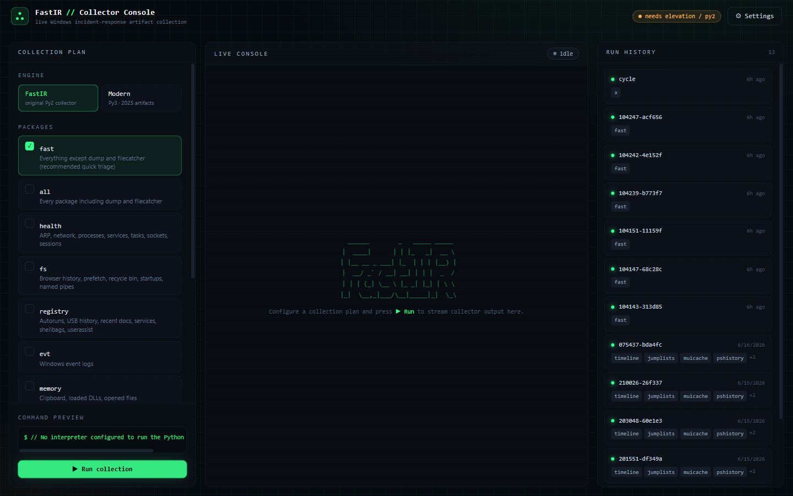
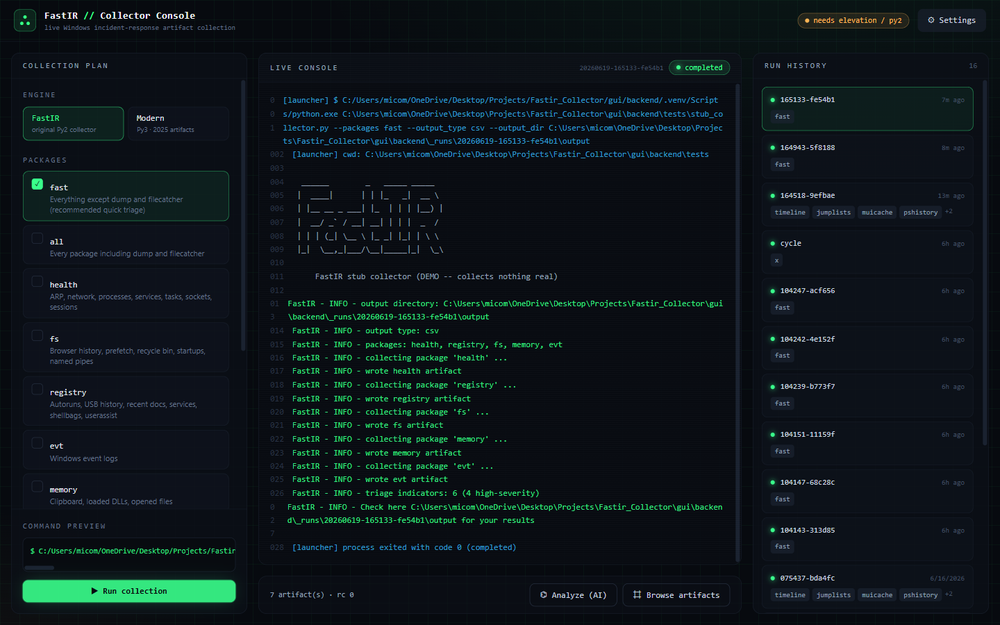
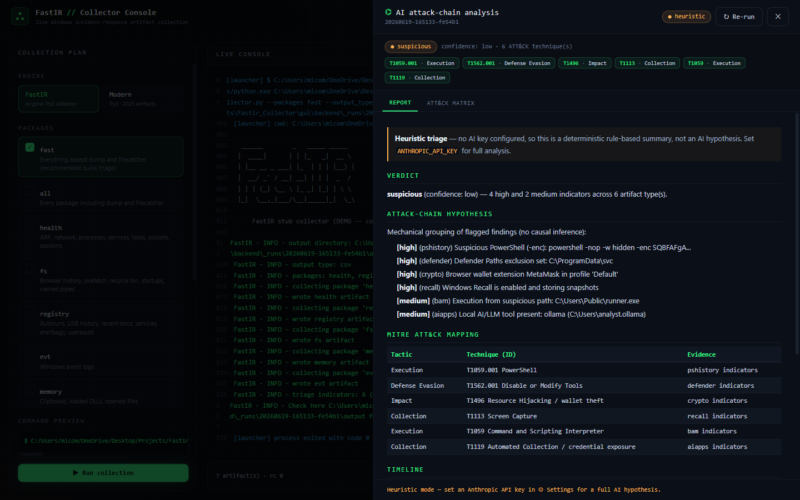
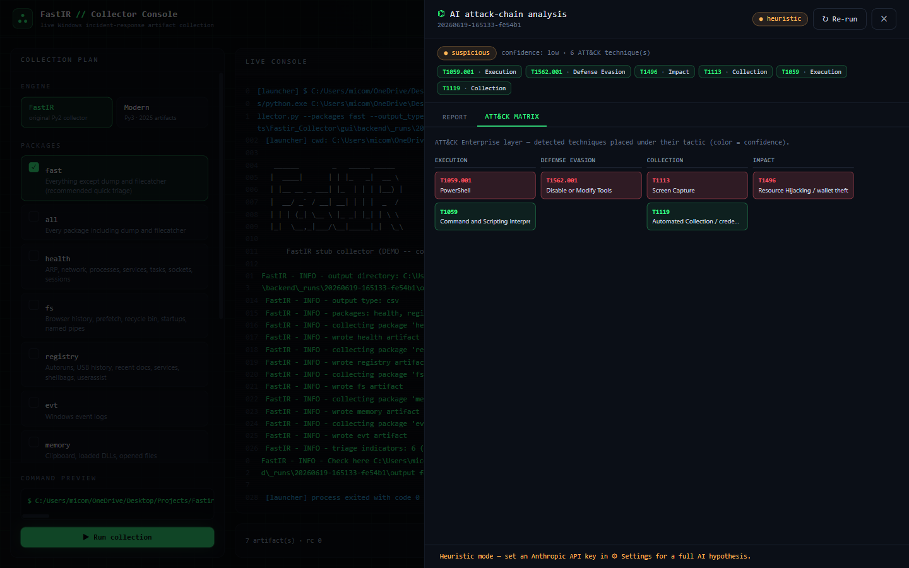
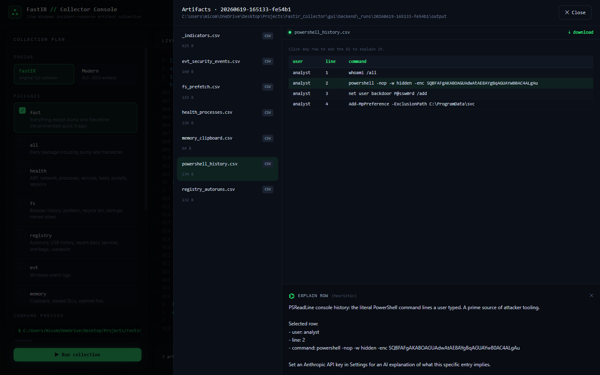

# FastIR Collector 2.0

> **An enhanced, modernized edition of [SekoiaLab's FastIR Collector](https://github.com/SekoiaLab/Fastir_Collector).**
> The original is a battle-tested CLI that collects forensic artefacts from live Windows hosts. **2.0** keeps that
> engine intact and wraps it in a fast web console, adds a native **Python 3 collector for the modern artefacts the
> 2015-era tool never covered**, and bolts on an **AI engine** that reasons over the evidence to propose an
> attack-chain hypothesis.



## Concepts

FastIR Collector gathers artefacts from a live Windows system and records them as CSV or JSON. By analysing those
artefacts an early compromise can be detected. 2.0 makes that workflow faster and far broader:

- **Drive the real collector from a browser** — no more remembering CLI flags.
- **Collect modern evidence** — Windows Recall, local AI/LLM tooling, cryptocurrency wallets, execution caches, and
  more — that simply did not exist when the original tool was written.
- **Get a head start on analysis** — an AI engine turns raw artefacts into a ranked, ATT&CK-mapped hypothesis.

Nothing about the original forensic logic was changed; 2.0 only **adds** around it.

---

## FastIR 1.x vs 2.0 at a glance

| | FastIR Collector 1.x | **FastIR Collector 2.0** |
|---|---|---|
| **Interface** | Command line only | Web console **+** the original CLI |
| **Runtime** | Python 2 (compiled `.exe`) | Py2 collector **+** a native **Python 3** modern engine |
| **Output** | CSV / JSON files on disk | Live-streamed console, in-app artefact browser, CSV / JSON files |
| **Artefact scope** | 2015-era (fs, health, registry, memory, evt, dump, FileCatcher) | All of 1.x **+ 14 modern collectors** (Recall, AI/LLM, crypto, BAM, ShimCache, Jump Lists, Timeline, …) |
| **Parsing depth** | Enumeration + classic parsers | Deep parsing: OLE2 `DestList` **+** `LNK` targets, SQLite Timeline/Recall **+ OCR**, ShimCache blob |
| **Triage** | Manual review of CSVs | Auto **severity-ranked `_indicators`** per run |
| **Analysis** | Performed by the analyst | **AI engine**: attack-chain hypothesis, MITRE ATT&CK mapping + matrix, per-row "explain this" |
| **Try it anywhere** | Needs Windows + admin + Python 2 | A bundled **demo stub** runs on any OS, no dependencies |
| **Tests** | — | **48** automated tests |

---

## What's new in 2.0

| Area | Enhancement |
|------|-------------|
| **Web console** | A fast, fluid local GUI (FastAPI + React/TypeScript) that builds the exact collector command, launches it, **streams output live** (SSE), and lets you browse the resulting artefacts. |
| **Two engines** | Toggle between the original **FastIR** (Python 2 / compiled `.exe`) and a new **Modern** Python 3 collector — selectable per run. |
| **Modern artefacts** | 14 post-2015 artefact collectors (see the coverage tables below), including the newest of all: Windows 11 Recall, local AI/LLM tooling, and crypto wallets. |
| **Deep parsing** | Artefacts are parsed to their contents, not just enumerated: Jump List `DestList` (OLE2) **and** individual `LNK` targets (MS-SHLLINK), Windows Timeline & Recall SQLite with OCR text, and the ShimCache binary blob. |
| **Triage indicators** | Every modern run writes a severity-ranked `_indicators` file flagging suspicious findings (execution from temp/appdata, encoded PowerShell, Defender exclusions, leaked API keys, crypto wallets, Recall snapshots). |
| **AI engine** | "Analyze (AI)" streams an attack-chain hypothesis from **Claude** (`claude-opus-4-8`) — verdict, **MITRE ATT&CK mapping**, timeline, and next steps — plus an ATT&CK-Navigator-style matrix and per-row "explain this". Deterministic heuristic fallback when no API key is set. |
| **Artifact browser** | In-app CSV/JSON preview with parsed tables, download, and click-a-row-to-explain. |
| **Run history** | Persisted across restarts; every run's command, log, and artefacts are kept under `gui/backend/_runs/`. |
| **Tested** | 48 automated backend tests (parsers, heuristics, run lifecycle, end-to-end API) + a frontend type-check/build gate. |
| **Runs anywhere** | A bundled demo stub speaks the same CLI, so the entire UI can be explored on any OS without Python 2, Windows, or admin. |

> The console and everything above live in [`gui/`](gui/). See **[gui/README.md](gui/README.md)** for the full
> architecture, API reference, and setup details.

---

## Screenshots

> The captures below use the bundled **demo stub** (synthetic data), so no real host data is shown.

| Live collection | AI attack-chain analysis |
|---|---|
|  |  |
| Pick an engine + packages and watch the collector stream live. | Claude proposes a verdict, attack-chain, and ATT&CK mapping. |

| ATT&CK matrix | Explain an artefact row |
|---|---|
|  |  |
| Detected techniques laid out Navigator-style, coloured by confidence. | Click any row to have the AI explain that specific entry. |

---

## Forensic artefact coverage

### Original packages (FastIR engine — unchanged)

| Package | Artefacts |
|---------|-----------|
| **fs** | IE/Firefox/Chrome history & downloads, named pipes, prefetch, recycle bin, startup directories |
| **health** | ARP table, drives, network drives, network cards, processes, routing table, tasks, scheduled jobs, services, sessions, network shares, sockets |
| **registry** | Installer folders, OpenSaveMRU, recent docs, services, shellbags, autoruns, USB history, userassists, networks list |
| **memory** | Clipboard, loaded DLLs, opened files |
| **evt** | Windows event logs |
| **dump** | MFT, MBR, RAM, disk, registry, SAM |
| **FileCatcher** | File hunt by MIME type, path/depth filtering, YARA rules |

### New modern artefacts (Modern engine — added in 2.0)

A native Python 3 collector ([`gui/backend/modern_collector.py`](gui/backend/modern_collector.py), standard library
only). It runs on the same Python that powers the console, so **user-level artefacts collect on a live host without
admin**. Artefacts marked 🛡 read protected/SYSTEM data and benefit from elevation.

| Package | What it surfaces | Admin |
|---------|------------------|:----:|
| **bam** | BAM/DAM — per-user program execution with last-run timestamps | 🛡 |
| **shimcache** | AppCompatCache — execution / presence evidence (Win8/10/11 parser) | 🛡 |
| **muicache** | MUICache — names of executed applications | |
| **recentapps** | Search RecentApps — launched apps, counts, last-access times | |
| **pshistory** | PSReadLine console history — the literal PowerShell command lines | |
| **timeline** | Windows Timeline (`ActivitiesCache.db`) — app/document activity history | |
| **jumplists** | Jump lists — MRU `DestList` (OLE2) **and** individual `LNK` targets (path, args, working dir, timestamps) | |
| **defender** | Microsoft Defender exclusions + detection history | 🛡 |
| **amcache** | Acquire `Amcache.hve` for offline execution analysis | 🛡 |
| **srum** | Acquire `SRUDB.dat` (System Resource Usage Monitor) | 🛡 |
| **aiapps** 🆕 | Local AI/LLM tooling (Ollama, LM Studio, GPT4All, Jan, ChatGPT/Claude/Cursor/Copilot) **and leaked API keys** (always redacted) | |
| **recall** 🆕 | Windows 11 **Recall** snapshot DB (`ukg.db`) + image store, with window-capture rows and OCR text | |
| **crypto** 🆕 | Cryptocurrency wallet files (Bitcoin/Electrum/Exodus/Ledger/Monero/…) and browser wallet extensions (MetaMask, Phantom, Coinbase, …) | |

---

## The AI engine

Press **⌬ Analyze (AI)** on any completed run. The console digests the artefacts (triage indicators + sampled rows)
and streams a structured analyst report from **Claude** (`claude-opus-4-8`, adaptive thinking) via the official
Anthropic SDK:

- **Verdict** — benign / suspicious / likely-malicious, with confidence
- **Attack-chain hypothesis** — an evidence-linked narrative
- **MITRE ATT&CK mapping** — tactic · technique · evidence, also rendered as a Navigator-style **matrix** (one column
  per tactic, cells coloured by confidence) and a chip strip
- **Timeline** and **Recommended next steps**

In the artifact browser, **click any CSV row** to have the AI explain that specific entry forensically.

The prompt enforces **hypotheses, not conclusions**, tied to evidence. The API key comes from `ANTHROPIC_API_KEY` or
the in-app Settings panel and is never logged; detected keys in artefacts are redacted before they ever leave the
host. With no key configured, every AI feature falls back to a deterministic heuristic so the tool still works offline.

---

## Quick start (2.0 console)

```powershell
cd gui
./run.ps1          # Windows; run as administrator for a real collection
# then open http://127.0.0.1:8099
```

```bash
cd gui && ./run.sh   # macOS/Linux — explore the UI via the bundled demo stub
```

- **Run a real FastIR collection** — launch as administrator and, in ⚙ Settings, point the collector at `main.py`
  (interpreter `py -2`) or a compiled `fastIR_x64.exe`.
- **Run the Modern engine** — works immediately on a live Windows host on plain Python 3 (no admin for user-level
  artefacts).
- **Just exploring?** — Settings → "use bundled demo stub" runs on any OS with no dependencies.

Tests:

```powershell
cd gui/backend
./.venv/Scripts/python.exe -m pip install -r requirements-dev.txt
./.venv/Scripts/python.exe -m pytest tests/ -q     # 48 tests
```

---

## Classic CLI (original FastIR Collector)

The original command-line tool is unchanged and still available.

- **Downloads** — binaries are on the upstream [release page](https://github.com/SekoiaLab/Fastir_Collector/releases).
- **Requirements** — pywin32, python WMI, python psutil, python yaml, construct, distorm3, hexdump, pytz (a `pip freeze` is in `reqs.pip`).
- **Compiling** — with [PyInstaller](https://github.com/pyinstaller/pyinstaller): `pyinstaller pyinstaller.spec` at the repo root; the binary lands in `/dist`. On x64, make sure your Python is x64 too.

```text
./fastIR_x64.exe -h                                      # help
./fastIR_x64.exe --packages fast                         # all artefacts except dump and FileCatcher
./fastIR_x64.exe --packages dump --dump mft              # extract the MFT
./fastIR_x64.exe --packages all --output_dir <dir>       # full collection to a custom directory
./fastIR_x64.exe --profile <profile.conf>                # custom extraction profile
```

Profile docs are in the upstream [wiki](https://github.com/SekoiaLab/Fastir_Collector/wiki/Create-a-profile).

---

## Credits

FastIR Collector was created by **SekoiaLab** ([upstream repository](https://github.com/SekoiaLab/Fastir_Collector)).
The 2.0 web console, Modern Python 3 artefact engine, deep parsers, and AI analysis engine in [`gui/`](gui/) are an
independent enhancement layer built on top of that tool. See [`LICENSE`](LICENSE) for licensing.
